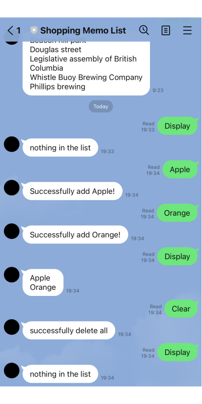

# Overview

The Shopping List application is designed to simplify the task of remembering what items to buy. It serves as a convenient memo tool for users who often forget their shopping needs. This app is particularly useful for individuals like me and my partner, who wanted a straightforward way to manage our shopping lists without the complexity of traditional note-taking applications.

## Features

### Create

To add a new item to the list, simply type the name of the item you wish to remember and send it through the LINE messaging platform. This action will automatically add the item to your shopping list without requiring any additional commands.

### Read

To view all items currently on your shopping list, type "Display" and send the message. The app will respond with a list of all items stored in the database.

### Delete

There are two ways to remove items from your shopping list:

- Specific Item Deletion: Type "Delete" followed by the name of the item you wish to remove. This command will delete the specified item from your list.

- Clear List: To remove all items from your shopping list, type "Clear" and send the message. This will clear the entire list, leaving it empty for future additions.

## Utilize Line Feature

For ease of use, the app leverages LINE's "Rich Menu" feature, allowing users to quickly access common commands like "Display" and "Clear" with a single tap. This integration enhances the user experience by making the app more intuitive and efficient.

## Tech Stack

- Frontend: LINE Message API
- Backend: Supabase Edge Function in TypeScript
- Database: Supabase

This combination of technologies ensures a seamless and scalable application architecture, capable of handling user requests efficiently while maintaining data integrity.

# Summary

The Shopping List application has proven to be a practical tool for managing our shopping needs over several weeks of use. Beyond its utility, developing this app also served as an excellent opportunity to learn about deploying applications, connecting to databases, and integrating with popular messaging platforms like LINE.
